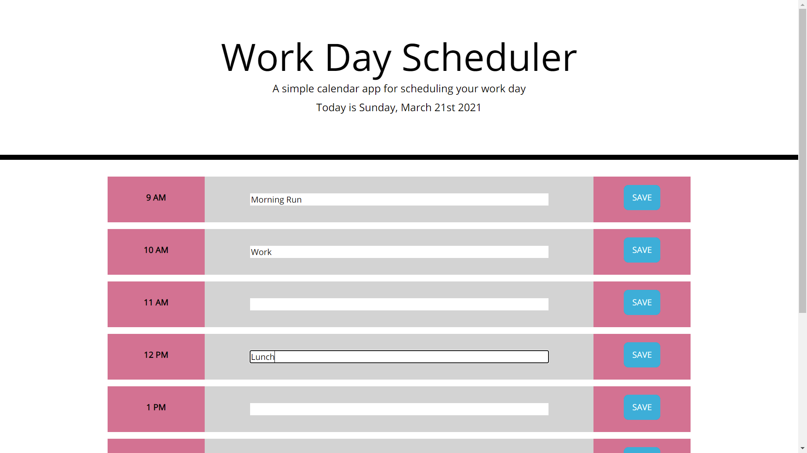

# Work Day Scheduler
This is a simple calendar application that allows a user to save events for each hour of the day. This site was built using jQuery and Moment.js. The page structure and styling was provided in the starter code which can be found <a href="https://github.com/coding-boot-camp/super-disco">here</a>. 

Events can be saved to local storage, and will persist even if the page is closed and reopened. Events are also color coded based on if the given hour is in the past, present, or future.

The deployed site is viewable <a href="https://mikeyrod22.github.io/rhythm-shift/">here</a>.

***

